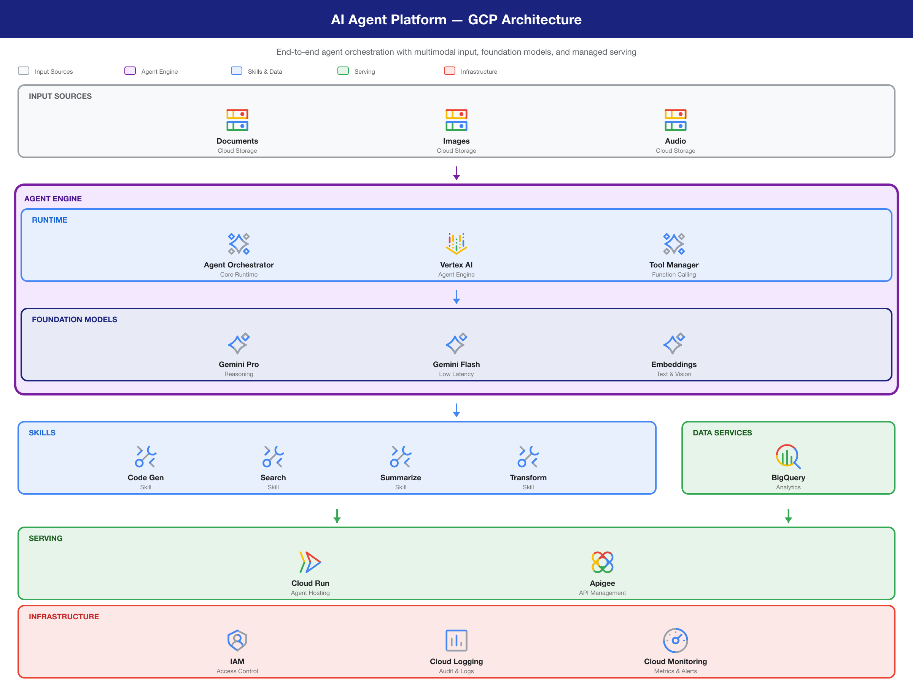
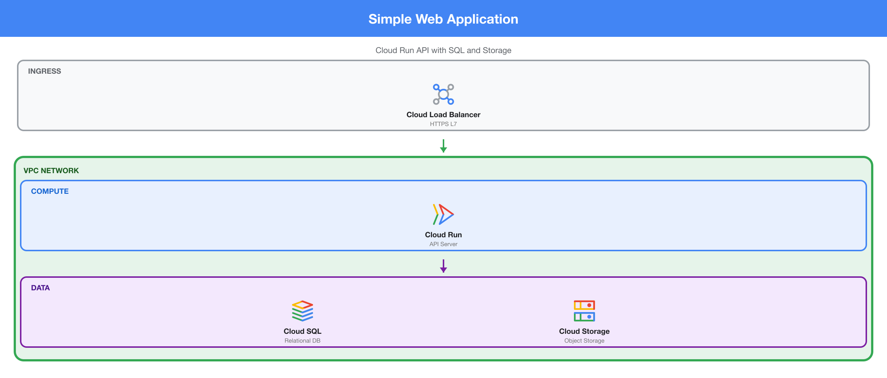
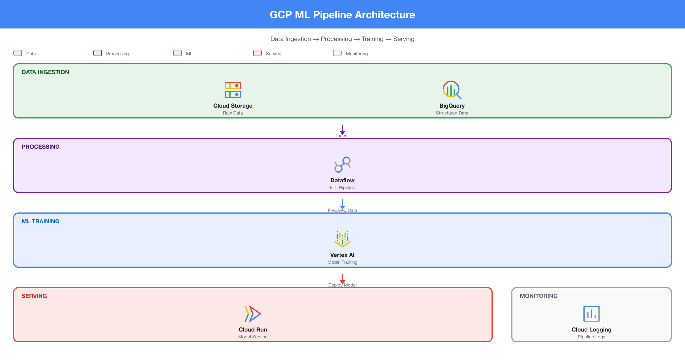
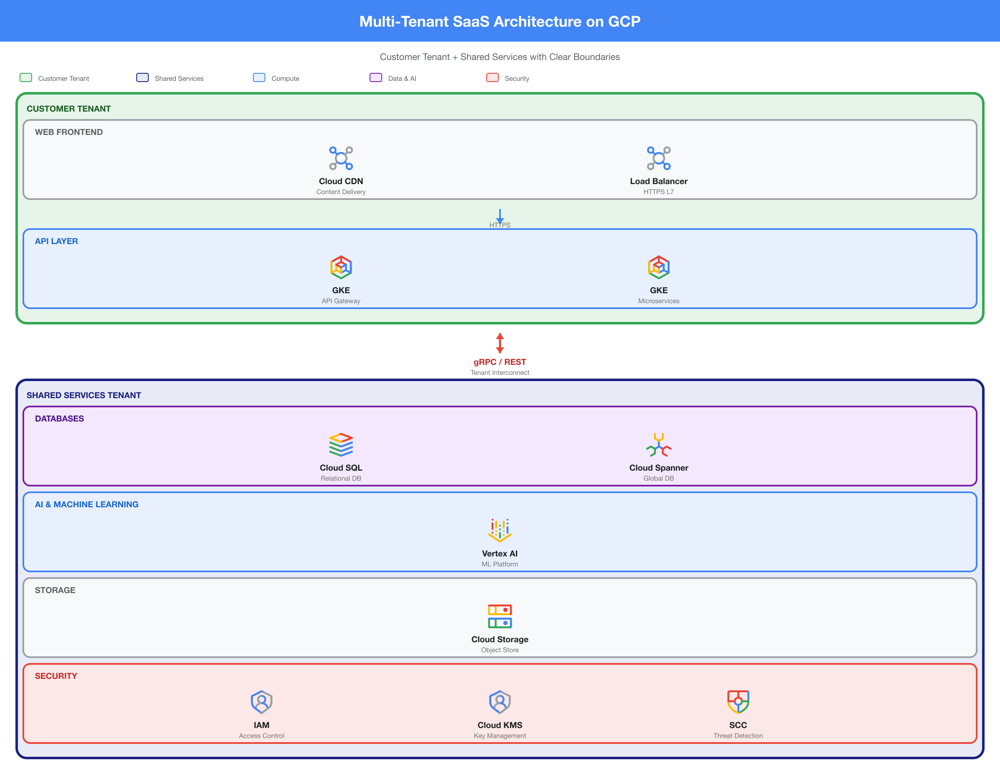
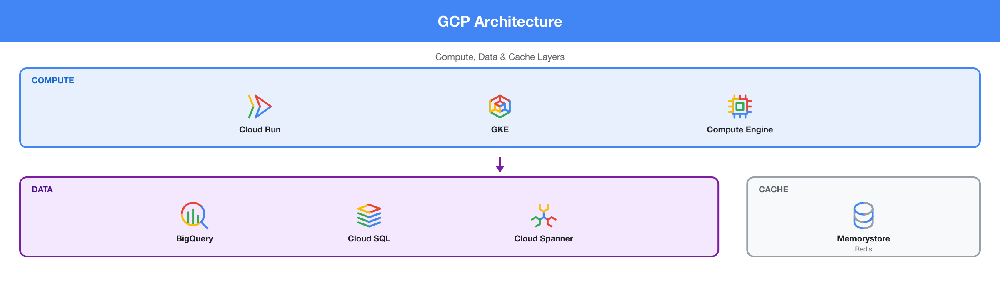

# GCP Architecture Diagram Skill

A skill for AI coding agents that generates professional, pixel-perfect GCP architecture diagrams as SVG using official Google Cloud icons.

The agent writes a **declarative JSON spec** describing the diagram. A bundled Python renderer validates it and produces pixel-perfect SVG with 45 official icons embedded as inline vectors.



## What It Does

- **Declarative JSON spec** — the agent writes data, not code (~30 lines vs ~150 lines of Python)
- **45 official GCP icons** (19 product + 26 category) pre-bundled as Iconify JSON
- **Pixel-perfect SVG output** with inline vector icons — no base64 bloat, no Mermaid
- **Built-in validation** catches bad icon IDs, invalid colors, and structural errors before rendering
- **6 element types**: layers, arrows, containers, splits, bridges, legends
- **Zero external dependencies** — Python 3 stdlib only
- **Optional HTML output** — auto-wraps SVG in an HTML viewer for easy sharing

## Installation

### Claude Desktop (ZIP upload)

1. Download the latest `gcp-architecture-diagram.zip` from the [Releases page](https://github.com/MisterTK/gcp-architecture-diagram/releases)
2. In Claude Desktop, go to **Customize → Skills → Add Skill**
3. Upload the ZIP file

> The ZIP is automatically built and attached to every release via GitHub Actions.

### Skills CLI (Claude Code, Cursor, Codex, ADK, and more)

```bash
# Install into current project
npx skills add MisterTK/gcp-architecture-diagram

# Install globally
npx skills add -g MisterTK/gcp-architecture-diagram
```

### Claude Code Plugin

```bash
# Install into current project
claude plugin add MisterTK/gcp-architecture-diagram

# Install globally
claude plugin add -g MisterTK/gcp-architecture-diagram
```

### Google ADK

```python
from google.adk.tools.skill_toolset import SkillToolset

# After cloning the repo or running npx skills add
toolset = SkillToolset(skill_dir="path/to/skills/gcp-architecture-diagram")
```

Or via skills CLI (installs to `./agent/skills/gcp-architecture-diagram`):
```bash
npx skills add MisterTK/gcp-architecture-diagram
```

### Manual

```bash
# Claude Code plugin (project-level)
git clone https://github.com/MisterTK/gcp-architecture-diagram.git .claude/plugins/gcp-architecture-diagram

# Claude Code plugin (global)
git clone https://github.com/MisterTK/gcp-architecture-diagram.git ~/.claude/plugins/gcp-architecture-diagram
```

## Usage

Ask your AI agent to create a GCP architecture diagram:

```
> Create a GCP architecture diagram showing Cloud Run connecting to
  BigQuery and Cloud Storage, with a VPC wrapper

> Diagram our GCP ML pipeline: Cloud Storage -> Dataflow -> Vertex AI -> Cloud Run

> Generate a multi-tenant architecture with Customer and Shared Services tenants
```

The skill will:
1. Map services to official GCP icon IDs
2. Write a JSON spec file describing the layout
3. Validate the spec against the icon pack
4. Render pixel-perfect SVG using `render.py`
5. Optionally convert to PNG or HTML

## How It Works

```
User describes architecture
        ↓
Agent writes JSON spec (~30 lines)
        ↓
render.py validates spec (icon refs, colors, structure)
        ↓
render.py calculates heights (recursive first pass)
        ↓
render.py renders SVG (recursive second pass)
        ↓
Pixel-perfect SVG with inline vector icons
```

### Why Not Graphviz or Mermaid?

- **Graphviz** (Python `diagrams` library) is a graph layout engine, not a page layout engine — it can't do grid layouts and clusters float unpredictably
- **Mermaid** `architecture-beta` is non-deterministic — layouts change on reload and the grid engine is fragile with complex diagrams
- **This skill** generates SVG directly with absolute pixel coordinates — deterministic, precise, professional

## Examples

### Simple Web App


### ML Pipeline


### Multi-Tenant SaaS


### Split Row


## JSON Spec Format

```json
{
  "title": "My GCP Architecture",
  "subtitle": "Production Environment",
  "elements": [
    {"type": "legend", "items": [{"color": "blue", "label": "Compute"}]},
    {"type": "layer", "label": "COMPUTE", "color": "blue", "services": [
      {"icon": "cloud-run", "label": "Cloud Run", "sublabel": "API"}
    ]},
    {"type": "arrow", "color": "green"},
    {"type": "container", "label": "VPC", "color": "green", "elements": [...]},
    {"type": "split", "ratios": [3, 1], "elements": [...]},
    {"type": "bridge", "label": "A2A Protocol", "color": "red"}
  ]
}
```

## Available Icons

**19 Product icons:** Cloud Run, Cloud SQL, Cloud Spanner, Cloud Storage, BigQuery, Compute Engine, GKE, Vertex AI, AlloyDB, Apigee, Anthos, Looker, Hyperdisk, Distributed Cloud, AI Hypercomputer, Mandiant, Security Command Center, Security Operations, Threat Intelligence

**26 Category icons:** AI/ML, Agents, BI, Collaboration, Compute, Containers, Data Analytics, Databases, DevOps, Developer Tools, Hybrid/Multicloud, Integration Services, Management Tools, Maps/Geospatial, Marketplace, Media Services, Migration, Mixed Reality, Networking, Observability, Operations, Security/Identity, Serverless, Storage, Web/Mobile, Web3

For services without a dedicated icon (Cloud Functions, Pub/Sub, Dataflow, etc.), the skill maps to the closest category icon.

## Updating Icons

If Google releases new icons:

```bash
python skills/gcp-architecture-diagram/scripts/update_icons.py
```

This downloads the latest official icon ZIP and regenerates `skills/gcp-architecture-diagram/assets/gcp-icons.json`.

## Structure

```
gcp-architecture-diagram/
├── README.md                    # This file
├── LICENSE                      # MIT
├── .claude-plugin/
│   └── plugin.json              # Plugin manifest
├── skills/
│   └── gcp-architecture-diagram/
│       ├── SKILL.md             # Agent instructions with spec format and icon catalog
│       ├── assets/
│       │   └── gcp-icons.json   # 45 official GCP icons (Iconify JSON, 82KB)
│       ├── scripts/
│       │   ├── render.py        # JSON spec → SVG/HTML renderer (stdlib only)
│       │   └── update_icons.py  # Download + convert fresh icons
│       └── references/
│           └── advanced-layouts.md  # Complex layout patterns
├── examples/                    # Example diagram outputs
└── evals/
    └── evals.json               # 5 test cases with assertions
```

## License

MIT. GCP icons are property of Google LLC, subject to [Google Cloud brand guidelines](https://cloud.google.com/terms/branding).
